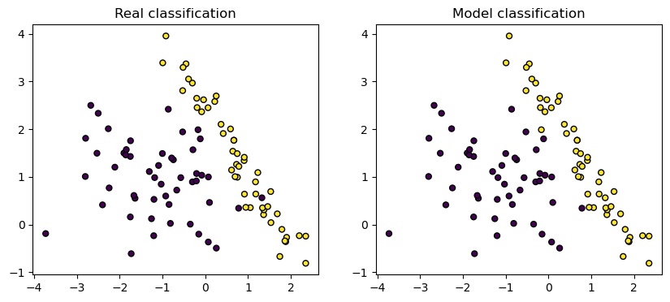

# Autograd-engine
Autograd is a minimalistic automatic differentiation library implemented in Python, featuring a small neural network library built on top of it with a PyTorch-like API. It supports backpropagation using a dynamically built Directed Acyclic Graph (DAG). Automatic differentiation in PyTorch works by creating a DAG with the tensors as nodes in the graphs. To perform backpropagation, the DAG is topologically sorted and the chain rule is used to differentiate the elements. My autograd engine performs similar operations but works only on scalar values.

<h2> Usage Demo </h2>

``` python
from autograd import Value

a = Value(10)
b = a * 20
c = b ** 2
d = (c - 4)/3
e = d.relu()
print('hiiii')
print(f'{e.data}') # prints value of e (13332.0)
print(f'{e.grad}') # prints 0.0 since grad is currently 0
e.backward()
print(f'{e.grad}') # the gradient gets populated (1.0)
```
<h2> Training a deep neural net </h2>

The demo of a deep neural net is show in use_case.ipynb. The neural net was trained on a sample dataset to perform binary classification. This is done by initializing a neural network from the autograd.nn module and using the binary cross entropy loss and stochastic gradient descent algorithm (SGD). These were the final results:


